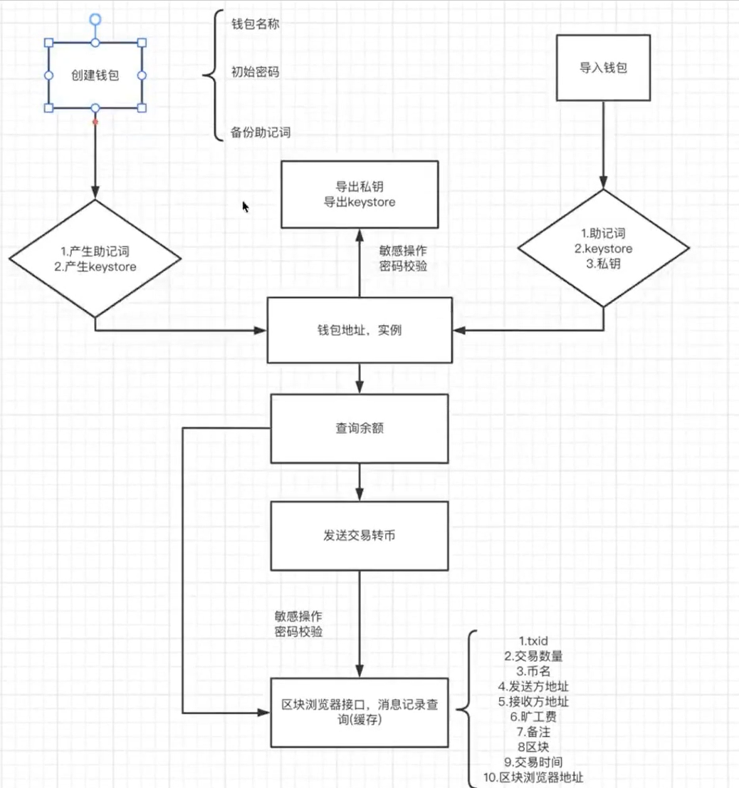
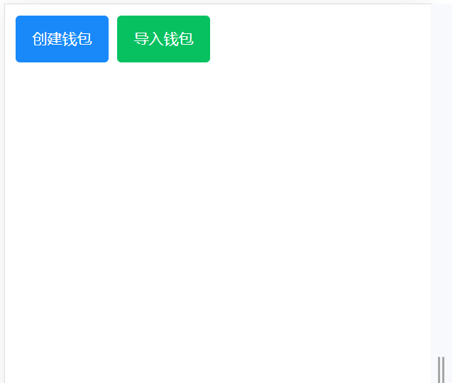
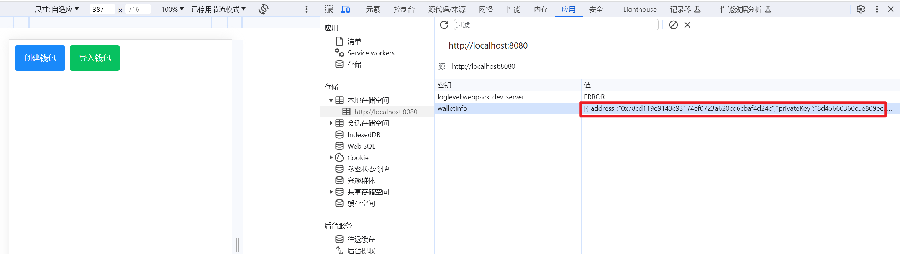

#### 

## 区块链钱包项目流程




### 项目准备

创建项目

```
vue create web3-wallet-app
```

**web3相关第三方包**

```shell
npm install web3 bip39 ethereumjs-tx@1.3.7 ethereumjs-util ethereumjs-wallet
```

> ethereumjs-tx使用1.3.7版本

**node-polyfill兼容文件配置**

1.下载polyfill插件

```
npm install node-polyfill-webpack-plugin -D
```

在vue.config.js中配置

```js
const { defineConfig } = require('@vue/cli-service')
//引入插件
const NodePolyfillWebpackPlugin=require("node-polyfill-webpack-plugin")

module.exports = defineConfig({
  transpileDependencies: true,
  // 插件配置
  configureWebpack: {
    plugins: [
      new NodePolyfillWebpackPlugin()
    ],
  },
})

```

**[vant-ui UI组件库](https://vant-contrib.gitee.io/vant/#/zh-CN)**

```
npm i vant
npm i unplugin-vue-components -D
```

在vue.config.js中配置插件

```js
const { defineConfig } = require('@vue/cli-service')
//引入插件
const NodePolyfillWebpackPlugin=require("node-polyfill-webpack-plugin")
// vant
const {VantResolver}=require("unplugin-vue-components/resolvers")
const ComponentsPlugin=require("unplugin-vue-components/webpack")

module.exports = defineConfig({
  transpileDependencies: true,
  // 插件配置
  configureWebpack: {
    plugins: [
      new NodePolyfillWebpackPlugin(),
      ComponentsPlugin({resolvers: [VantResolver()]}),
    ],
  },
})

```

App.vue

```
<template>
  <div>hello</div>
</template>

<script setup>
import { ref } from "vue"

</script>

<style lang="less"></style>

```

### 页面构造

思考：用小狐狸的时候，先是提示输入密码，再助记词



components/Button.vue

```vue
<template>
    <!-- 间距 -->
    <van-space>
        <van-button type="primary" @click="createWallet">创建钱包</van-button>
        <van-button type="success">导入钱包</van-button>
    </van-space>
    <!-- 弹窗 -->
    <van-dialog v-model:show="show" title="请输入密码" show-cancel-button>
        <van-cell-group>
            <van-field v-model="password" type="password" name="密码" label="密码" placeholder="密码" />

        </van-cell-group>


    </van-dialog>
</template>
  
<script setup>
/**
 * 引入
 */
import { ref } from "vue"
import { showDialog } from 'vant';
import "vant/es/dialog/style"

/**
 * 界面变量控制
 */
const show = ref(false);// 弹窗显示
const password = "";
/**
 * 函数
 */
const createWallet = () => {
    show.value = true;
};

</script>
  
<style lang="less"></style>
  
```

App.vue

```vue
<template>
 <ButtonVue></ButtonVue>
</template>

<script setup>
import { ref } from "vue"
import ButtonVue from "./components/Button.vue"


 
</script>

<style lang="less">
body {
  padding:10px
}
</style>

```


### 本地存储

为了方便，模拟存储在本地

#### store2本地存储工具

```
npm i store2
```

```
import store2 from "store2"
store2("walletInfo",walletInfo);
```




